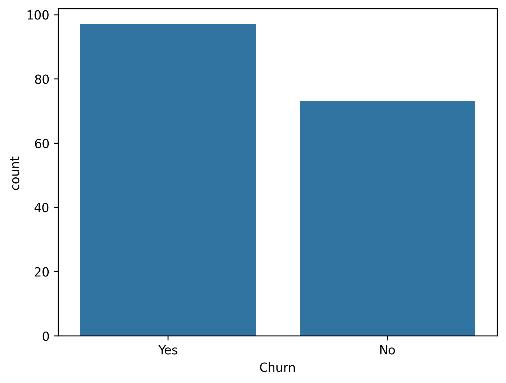
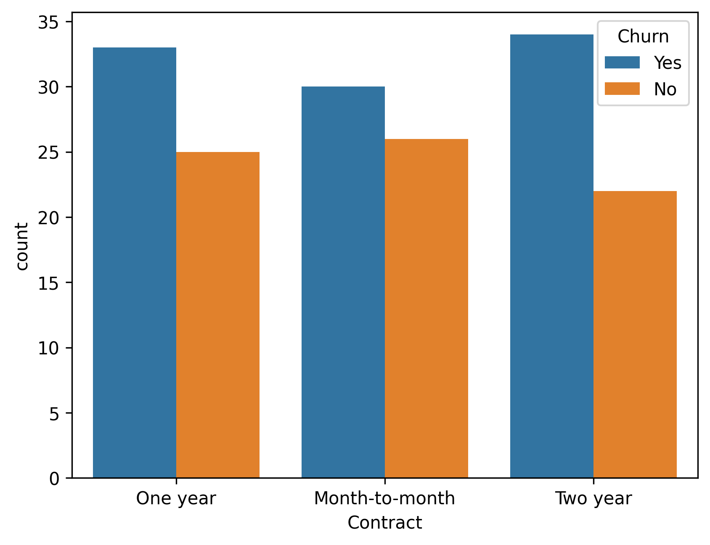
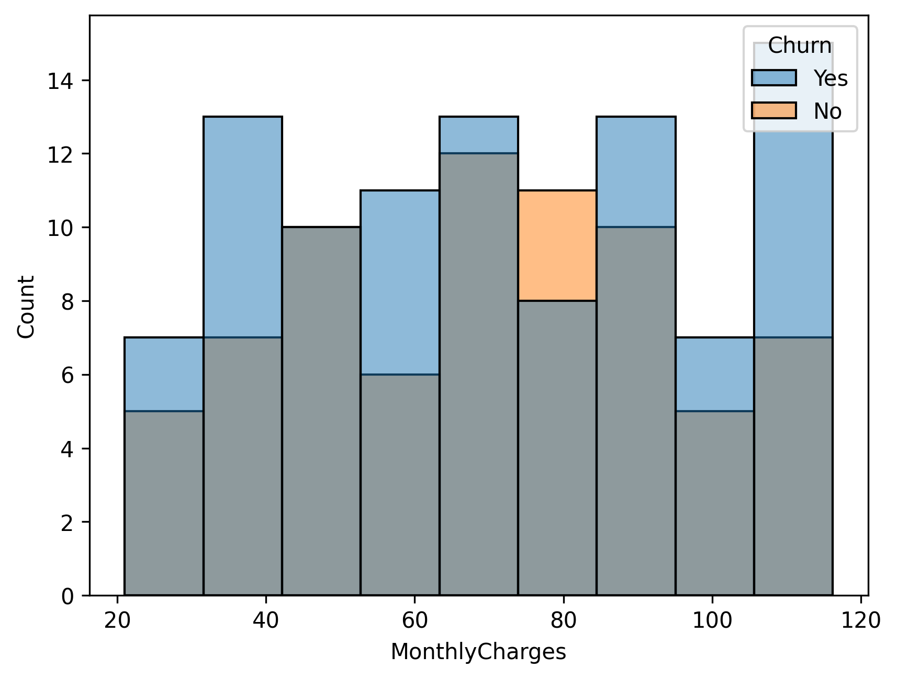
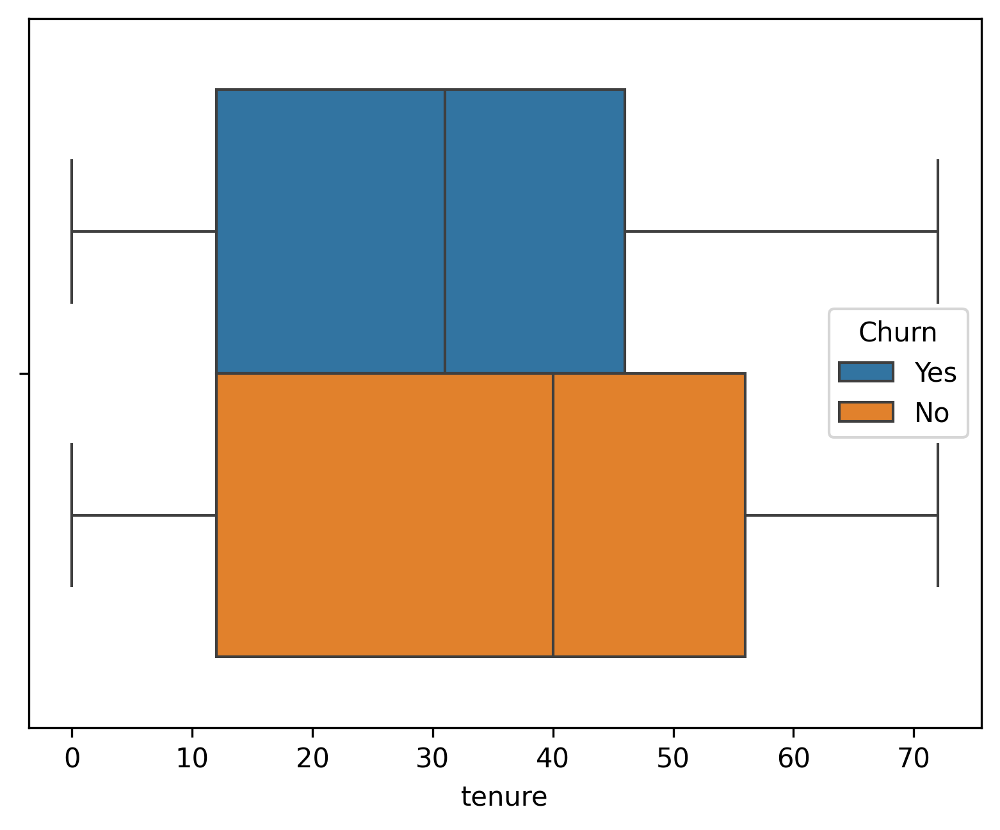
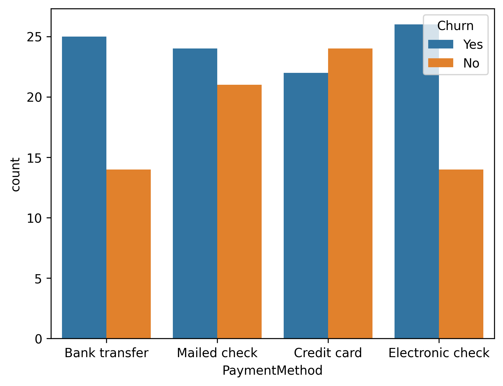

# 📉 Customer Churn Analysis using SQL & Python

## 📌 Overview
This project analyzes customer churn data to identify key factors that lead to customer attrition. The goal is to derive actionable insights that can help businesses improve customer retention.

---

## 🎯 Objectives
- Analyze customer behavior and churn patterns  
- Identify key factors influencing churn  
- Perform data analysis using SQL and Python  
- Visualize insights for better decision-making  

---

## 🛠️ Tools & Technologies
- Python (Pandas, NumPy)
- SQL
- Matplotlib / Seaborn
- Jupyter Notebook / Google Colab  

---

## 📂 Dataset
- Customer dataset containing:
  - Demographics  
  - Subscription details  
  - Monthly charges  
  - Tenure  
  - Contract type  

---

## 🔍 Key Analysis
- Data cleaning and preprocessing  
- Handling missing values and data types  
- SQL queries (GROUP BY, aggregations)  
- Churn rate analysis  
- Feature analysis:
  - Contract type  
  - Monthly charges  
  - Tenure  
  - Payment method  

---

## 📊 Visualizations

### 📊 Churn Distribution

### 📊 Contract Type vs Churn

### 📊 Monthly Charges vs Churn

### 📊 Tenure vs Churn

### 📊 Payment Method vs Churn

### 🤖 Model Prediction (Optional)

---

## 💡 Key Insights
- Customers with **month-to-month contracts** show the highest churn  
- Higher **monthly charges** are associated with increased churn  
- Customers with **short tenure** are more likely to leave  
- Certain **payment methods** show higher churn trends  
- Long-term contracts significantly reduce churn  

---

## ⚠️ Limitations
- Dataset size is limited  
- No advanced feature engineering  
- Model accuracy can be improved  

---

## 🚀 Future Improvements
- Apply advanced ML models (XGBoost, Random Forest tuning)  
- Add feature engineering (customer behavior metrics)  
- Build interactive dashboard (Power BI / Tableau)  

---

## 📁 Project Structure
